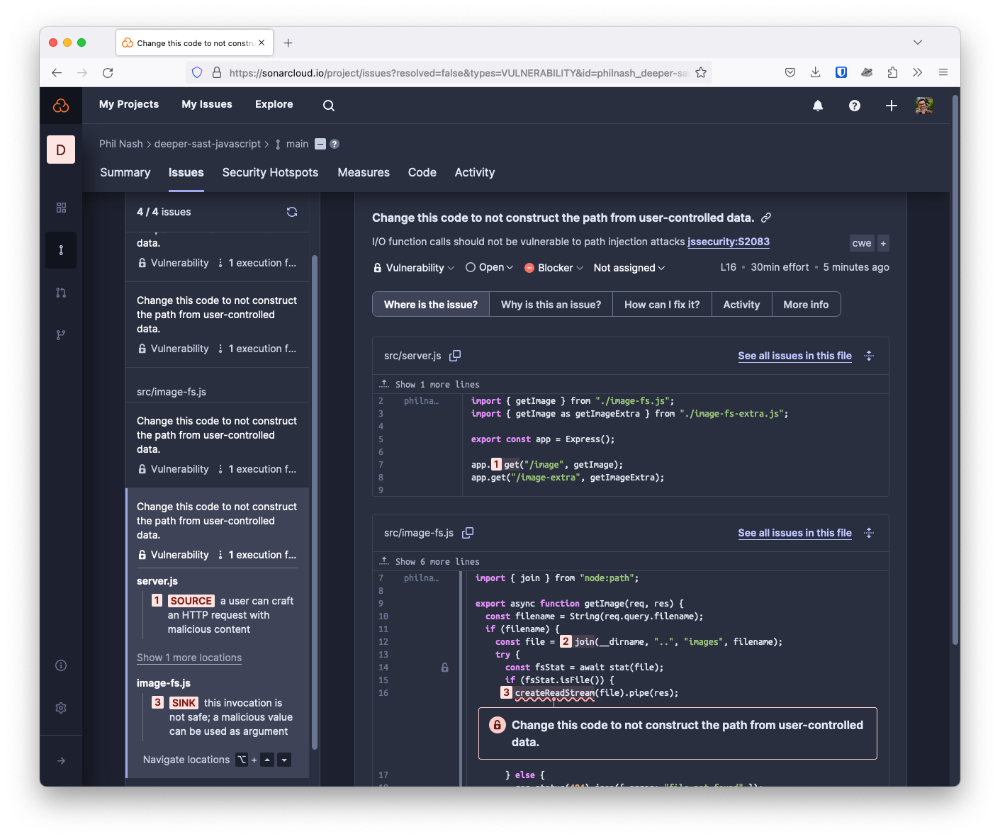
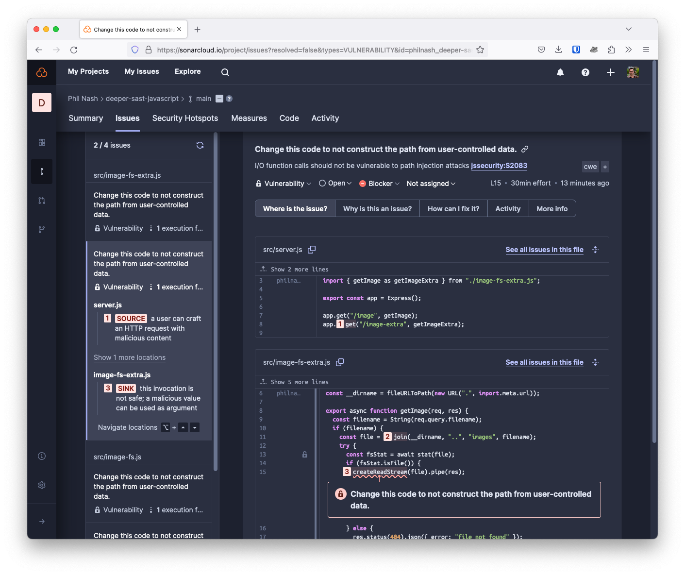

# Sonar SAST demo in JavaScript

This is a simple JavaScript project that is used to demonstrate [Sonar's deeper SAST](https://www.sonarsource.com/solutions/security/) capabilities.

- [Intro](#intro)
- [SAST](#sast)
  - [Deeper SAST](#deeper-sast)
- [Running the application](#running-the-application)
- [License](#license)

## Intro

The application is an Express server that has two endpoints, both of which are used to dynamically return a file from the file system. The code is intentionally simple and vulnerable to a [directory traversal attack](https://owasp.org/www-community/attacks/Path_Traversal). _Do not use code like this in your own application_. The goal is to demonstrate how Sonar can detect the vulnerability.

## SAST

Static Application Security Testing (SAST) is a method of testing the security of an application by examining its source code for vulnerabilities. SAST is one of the most efficient ways to find security flaws early in the development process, and Sonar's SAST capabilities are built into the commercial versions of [SonarQube](https://www.sonarsource.com/products/sonarqube/) and [SonarCloud](https://www.sonarsource.com/products/sonarcloud/) platforms.

In this example, the route `/image` is vulnerable to a directory traversal attack because it does not properly sanitize the filename that is passed through the query, which is then passed to the `stat` and `createReadStream` functions from Node's built-in [`fs` module](https://nodejs.org/api/fs.html).

You can see [how SonarCloud detects the vulnerability](https://sonarcloud.io/project/issues?resolved=false&types=VULNERABILITY&id=philnash_deeper-sast-javascript&open=AYnYBrsEF5NvR2klfg_o), tracking the data flow from the incoming request, from the `server.js` file to the `src/image-fs.js` file and through the `getImage` function.



### Deeper SAST

In order to better understand applications, deeper SAST enables Sonar's SAST engine to trace data flow in and out of third-party, open-source libraries. You can [read more about Sonar's deeper SAST capabilities here](https://www.sonarsource.com/solutions/security/).

In this example, the route `/image-extra` is almost exactly the same as the `/image` route, with the exception of using the [`fs-extra` library](https://www.npmjs.com/package/fs-extra). `fs-extra` is a drop-in replacement for the built-in `fs` module with some additional capabilities. In this case, we are using the same methods, just importing them from `fs-extra` instead. Without knowledge of the dependency and how it interacts with the file system, a SAST tool would overlook the vulnerability in `./src/image-fs-extra.js`, but Sonar's deeper SAST knows about the library and can spot the vulnerability.

You can see [that SonarCloud detects this vulnerability too](https://sonarcloud.io/project/issues?resolved=false&types=VULNERABILITY&id=philnash_deeper-sast-javascript&open=AYnYBrsEF5NvR2klfg_o), tracking the data flow from the incoming request, from the `server.js` file to the `src/image-fs-extra.js` file, through the `getImage` function and into the function from the third-party, open-source library `fs-extra`.



## Running the application

You can run the application if you want to see the vulnerability in action.

First, clone the repository from GitHub and change into the new directory:

```bash
git clone https://github.com/philnash/deeper-sast-javascript.git
cd deeper-sast-javascript
```

Install the dependencies:

```bash
npm install
```

Then start the server:

```bash
npm start
```

You can then make requests to the server on either of the endpoints: `/image` or `/image-extra`.

For example, if you make a request to [http://localhost:3000/image?filename=sonar.png](http://localhost:3000/image?filename=sonar.png) or [http://localhost:3000/image-extra?filename=sonar.png](http://localhost:3000/image-extra?filename=sonar.png) you will see a Sonar logo.

If you make a request to [http://localhost:3000/image?filename=../package.json](http://localhost:3000/image?filename=../package.json) or [http://localhost:3000/image-extra?filename=../package.json](http://localhost:3000/image-extra?filename=../package.json) you will see the contents of the `package.json` file. This is the vulnerability. And you can keep adding `../` to the query to traverse deeper into the file system.

## License

This project is licensed under the [MIT License](LICENSE).
